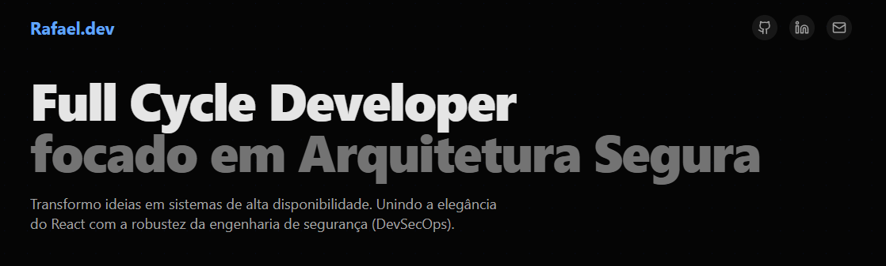
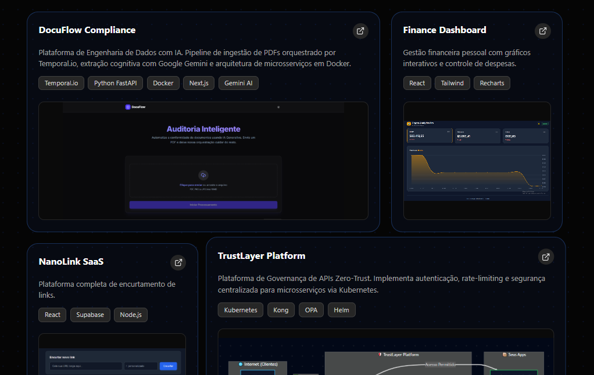

# Rafael Fassina | Full Cycle Developer

<div align="center">
  
  
  
  
</div>

<br />

> **"Transformando conceitos complexos em interfaces digitais intuitivas, performáticas e memoráveis."**

---

## 📸 Visão Geral

Este repositório hospeda o meu **Portfólio Pessoal**, uma vitrine interativa da minha trajetória profissional. O objetivo deste projeto vai além de listar experiências; ele demonstra na prática minha capacidade de entregar código limpo, arquitetura escalável e UX/UI de alto nível.

| Visão Geral | Projetos |
| :---: | :---: |
|  |  |

## ✨ Principais Funcionalidades

O projeto foi concebido com uma mentalidade **Product-First**, garantindo não apenas beleza, mas funcionalidade e performance.

-   📱 **Design Mobile First:** Layout totalmente responsivo, garantindo experiência fluida em qualquer dispositivo.
-   🌗 **Dark/Light Mode:** Suporte nativo a temas, respeitando a preferência do sistema do usuário.
-   ⚡ **Alta Performance:** Otimizado para Core Web Vitals (LCP, FID, CLS) utilizando as melhores práticas do Next.js.
-   📂 **Projetos Dinâmicos:** Seção de portfólio alimentada via CMS ou JSON estruturado para fácil atualização.
-   🎨 **Animações Fluidas:** Transições de página e micro-interações refinadas com Framer Motion.

## 🚀 Tech Stack & Ferramentas

Minha stack reflete uma abordagem **Full Cycle**: domino desde a criação de interfaces reativas até a orquestração de infraestrutura complexa e engenharia de dados.

| Categoria | Tecnologias | Detalhes |
| :--- | :--- | :--- |
| **Frontend & UI** | **Next.js 14**, React, Tailwind CSS | App Router, Server Components e animações com **Framer Motion**. |
| **Backend API** | **Python (FastAPI)**, Node.js | Desenvolvimento de APIs de alta performance e orquestração com **Temporal.io**. |
| **Infra & DevOps** | **Docker**, **Kubernetes**, Kong | Containerização, orquestração de microsserviços e API Gateway (Zero-Trust). |
| **Dados & AI** | **Supabase**, Google Gemini | Banco de dados relacional (Postgres) e integração com LLMs generativos. |
| **Linguagem** | **TypeScript**, Python | Tipagem estática rigorosa para garantir robustez e escalabilidade. |

## 💡 Projetos em Destaque

Aqui estão algumas das soluções técnicas complexas que desenvolvi, abrangendo desde engenharia de dados com IA até governança de microsserviços.

### 🤖 DocuFlow Compliance
Plataforma de Engenharia de Dados impulsionada por IA. O sistema orquestra um pipeline complexo de ingestão de PDFs, utilizando extração cognitiva para analisar documentos e garantir conformidade.
- **Stack:** `Temporal.io` `Python FastAPI` `Docker` `Next.js` `Gemini AI`
- 🔗 [Repositório](https://github.com/FassinaRafael/docuflow) 

### 🛡️ TrustLayer Platform
Uma plataforma robusta de Governança de APIs baseada no modelo Zero-Trust. Implementa segurança centralizada para arquiteturas de microsserviços, gerenciando autenticação, autorização e rate-limiting via Kubernetes.
- **Stack:** `Kubernetes` `Kong` `OPA (Open Policy Agent)` `Helm`
- 🔗 [Repositório](https://github.com/FassinaRafael/trustlayer) 

### 🔗 NanoLink SaaS
Uma plataforma completa e escalável para encurtamento e gerenciamento de links, focada em performance e experiência do usuário.
- **Stack:** `React` `Supabase` `Node.js`
- 🔗 [Repositório](https://github.com/FassinaRafael/nanoLink) | 🌐 [Live Demo](https://nano-link-iota.vercel.app/)

### 📈 Finance Dashboard
Aplicação de gestão financeira pessoal focada em visualização de dados, oferecendo gráficos interativos e controle intuitivo de despesas.
- **Stack:** `React` `Tailwind CSS` `Recharts`
- 🔗 [Repositório](https://github.com/FassinaRafael/financial-dashboard) | 🌐 [Live Demo](https://financial-dashboard-blue-three.vercel.app/)

## 🛠️ Instalação e Uso

Se você deseja explorar o código fonte ou rodar o projeto localmente, siga os passos abaixo:

### Pré-requisitos

-   Node.js (v18 ou superior)
-   npm ou yarn

### Passo a passo

1.  **Clone o repositório:**
    ```bash
    git clone https://github.com/seu-usuario/seu-portfolio.git
    cd seu-portfolio
    ```

2.  **Instale as dependências:**
    ```bash
    npm install
    # ou
    yarn install
    ```

3.  **Configure as variáveis de ambiente (se necessário):**
    Crie um arquivo `.env.local` na raiz e adicione as chaves necessárias (ex: chaves de API).

4.  **Inicie o servidor de desenvolvimento:**
    ```bash
    npm run dev
    ```

5.  **Acesse o projeto:**
    Abra `http://localhost:3000` no seu navegador para ver o resultado.

## 📫 Vamos Conectar?

Estou sempre aberto a novas oportunidades e trocas de conhecimento sobre tecnologia.

<div align="center">
  <a href="https://www.linkedin.com/in/rafael-fassina-285316302" target="_blank">
    
  </a> 
  <a href="https://github.com/FassinaRafael" target="_blank">
    
  </a>
  <a href="mailto:fassinarafael1105@gmail.com">
    
  </a>
</div>

---

<p align="center">
  Desenvolvido por Rafael Fassina
</p>
